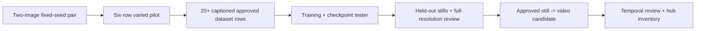

# Figment end-to-end delivery plan

## Decision

Current disposition, September 9: the Omni and Qwen cloud pairs completed, verified teardown, and both received root and independent STOP dispositions before expansion. Qwen finished at 16:48:42 UTC for an estimated $0.530662; zero pods were observed at 16:50:06 UTC, the arc is $38.778929/$50, and the daily provider estimate is $0.978544. The six-image built-in direct-g01 pilot is complete; the independent Sol review found it promising for a 20-plus-image research set. No built-in model identity, token usage, or incremental billing is exposed, and no image is dataset-promoted or trained. The approved-still video join is committed at `37820079`, with actual approval-to-manifest-to-upload integration and 18 distinct passing tests. See [Qwen result](2026-09-09-qwen-reference-cloud-result.md), [Qwen independent review](2026-09-09-qwen-reference-pair-independent-review.md), [pilot root review](2026-09-09-builtin-pilot-root-review.md), and [pilot independent review](2026-09-09-builtin-pilot-independent-review.md).

The generated-input gallery is complete at `adcf4591` and independently READY: 124 affected tests, typecheck, and an actual original-route probe passed. The production dashboard build also passed. This is local verification only, with no screenshot, deployment, or accepted-identity claim. The explicit canonical-ledger planner fix is reviewed in [ledger-plan binding review](2026-09-09-ledger-plan-binding-review.md) (73 tests, 167.86 seconds); it is no longer a work-in-progress item.

Build the smallest complete creator-001 path around the existing `figment_train.py`
contract, then make an approved still output the entry point to video and the existing
hub. Do not build another orchestrator. The system has a tested still-image planner/runner,
an evidence-preserving review gate, a diagnostic video compiler, and a locally built hub;
it does **not** have a quality-accepted identity, curated production dataset, accepted
production LoRA, held-out still set, or production video. Instagram remains deferred.

The hard user criterion is a consistent fictional adult woman who reads about 21, is
recognizably the accepted identity across variations, looks real at full resolution, and
is clothed. A completed command, green unit test, provider receipt, or model score is not
proof of that criterion.

## Current implementation snapshot

| Capability | Built / locally verified | Live-proven | Quality accepted |
| --- | --- | --- | --- |
| Persona, pins, bounded pod harness, plan/run/grade/ruling/gate CLI | Yes; `pipeline/figment_train.py` and its tests | Several historical train/tester runs | No production lineage |
| Identity gate and human lineage binding | Yes; fail-closed numeric and human records | Used on prior materials | No current candidate passes the user criterion |
| Reference-conditioned routes | OmniGen2 and Qwen cloud pairs are complete and rejected for expansion; built-in six-image direct-g01 pilot is complete and promising for research curation | Omni V1/V2 failed; V3 completed with two rejected files. Qwen completed two files for $0.530662 with verified teardown and both reviews STOP. Built-in pilot completed six files. | No |
| Training and checkpoint tester | Train-first/train/tester manifests and provenance checks | Historical runs completed | No checkpoint selected; prior LoRA was judged older/inconsistent |
| Held-out stills | `gen` is planned and gradeable in the existing CLI | No accepted source checkpoint for a new held-out run | No |
| Video | Native Wan compiler, assembly/extraction, and reviewed approved-still adapter; 18 distinct focused tests include actual approval-to-upload integration | V1, V2, and V3 clips completed; V2/V3 were stable in their inspected conditions | No production identity/temporal acceptance |
| Hub | Existing galleries have historical desktop/mobile QA; cloud lifecycle and generated-input gallery are complete | Cloud lifecycle 147-test slice, then 29 post-review tests; gallery 124 affected tests, typecheck, actual original-route probe, and production build passed | No accepted production lineage to display yet |

Sources: `orgs/figment/pipeline/README.md`, `orgs/figment/research/book/README.md`,
`docs/figment/2026-09-08-video-integration.md`, and
`docs/figment/2026-09-09-reference-pair-launch-packet.md`.

Before V3, the ledger total was $37.922815 of the $50 arc. The user explicitly authorized the
g01 transfer with “Continue.” V1’s failed archive URL ran 53.63 seconds at $0.019366 with no
uploads. V2 completed bootstrap, model staging, and g01 upload but stopped on HTTP 400 after
340.394 seconds at $0.103064; the unretained response was later diagnosed against the pinned
source as an omitted `resolution_steps` field.
Both failed pods have verified termination. V3 subsequently completed two images and verified
termination for $0.325452, bringing the arc to $38.248267. Both quality reviews rejected
expansion. Qwen completed for $0.530662 with verified teardown and both reviews STOP; see its
[current launch status](2026-09-09-qwen-reference-launch-status.md).

## What to take from the inspirations

10sorLabs markets a workflow sequence of identity lock, dataset generation, LoRA training,
and quality enhancement; its site describes these as product capabilities, not independent
quality evidence. [10sorLabs home](https://10sorlabs.com/) The useful implementation lesson
is the sequence and a small set of explicit handoffs, already reflected in Figment's
still-image stages. Its package research further supports training on a curated set and
testing checkpoints before broad generation; its account-growth and evasion material is
out of scope and rejected by Figment guardrails.

Eromify markets a persona-to-images-to-short-video content flow. [Eromify influencer maker](https://www.eromify.in/ai-influencer-maker)
That is a product claim, not evidence that its identity or video quality holds. The useful
product inference is to make the user-facing flow legible as a small sequence of named
assets: accepted identity, approved dataset, selected checkpoint, held-out stills, video
candidate, then library/hub. Figment should retain its stricter lineage, explicit human
rulings, and no-publish boundary rather than copying a one-click workflow.

## Critical path and gates



Root adjudicates bounded research continuation from recorded evidence; authorized research
does not wait on a mandatory human or consensus gate. Independent review remains a useful code
and evidence check where assigned. Human production promotion remains distinct. For any bounded
work order, allow at most two repair cycles after its first attempt; then stop and preserve the
evidence for a new hypothesis or ruling.

### Phase 0 — two-image pair, then a six-row varied pilot

The Omni and Qwen g01 cloud pairs completed, and both root and independent reviews stopped each before expansion. The completed built-in six-image pilot used g01 directly for every slot rather than chaining generated images. Its root and independent Sol reviews found a consistent, promising research hypothesis, without promoting an image into a dataset.

The six rows vary pose, framing, light, and clothed wardrobe while holding the
identity hypothesis. Pilot 03 and 06 are reserved evaluation candidates. g01 and
pilot 01, 02, 04, and 05 are the initial five train candidates; fifteen more
direct-g01 train candidates are planned to make 20. This partition is not an
accepted dataset or a training launch.

### Phase 1 — turn accepted identity evidence into a curated dataset

Use the existing `figment_train.py` review/ruling model rather than treating an output folder
as a dataset. Curate the next inventory as 20 train candidates and two reserved evaluation
candidates, then require captioned, hash-bound dataset approval before training. Keep the two
reserved evaluation images completely out of trainer media. The completed raw YuNet/SFace
records are unthresholded diagnostic observations only; they do not rank, accept, or reject a
candidate. Before any production dataset admission, clear every model and
dependency licence: OmniGen2's 3B Qwen-derived encoder remains research-only,
while Qwen's pinned 7B Apache-metadata stack needs separate production clearance.
See [component licence evidence](2026-09-09-qwen-component-license-evidence.md) for the pinned record.

Acceptance is not a target count. It is a set whose individual image bytes, caption sidecars,
and seven-axis human rulings remain current. A near-copy of g01 may help establish identity
but is insufficient dataset diversity.

### Phase 2 — train, test, and select a checkpoint

Run the existing `train-first` path against only the approved captioned set. Test each produced
checkpoint with the current tester plan and fixed holdout prompt family. Do not accept a
checkpoint from a training completion alone: `apply-rulings --checkpoint-step` already
requires a kept tester candidate and binds its source bytes. Compare the selected candidate
to g01 and held-out references at full resolution for the user criterion, not cosine alone.

### Phase 3 — held-out stills

Use `figment_train.py plan/run/grade/apply-rulings/gate --stage gen` with the chosen checkpoint
to make a deliberately held-out still set. The first accepted set should be small and varied,
not a content batch: front/quarter turn, two lighting conditions, and two clothed settings.
The output must preserve the adult-about-21 read and identity under variation before it becomes
a video start-frame candidate.

### Phase 4 — video

Do not promote the current Wan diagnostics. V1 was rejected for face distortion, colored
streaks, and background warping; V2/V3 establish bounded clips under their inspected
conditions only. The approved-still adapter is built, reviewed and committed, with 18 distinct
passing tests including actual approval and harness upload expansion. It consumes existing approved `gen` lineage while retaining the compiler’s diagnostic,
non-promotable output. Start with one short, low-motion clothed shot and inspect
first/middle/last frames plus the complete clip. A video failure does not invalidate the still
checkpoint; it blocks video only.

### Phase 5 — hub

The existing hub already projects generated inputs, matched/profile galleries and training
results in `dashboard/server/figment/**` and `FigmentWorkspace.tsx`; desktop/mobile checks
are recorded. Extend its proven projection discipline to the accepted lineage when it exists,
while retaining explicit diagnostic/unapproved labels and preventing private-path, prompt, or
credential leakage. The historical 141-case targeted batch recorded 140 passes and one pass-1
timeout; its isolated fix now passes in 496 ms. The cloud lifecycle five-file slice passes 147
tests. Instagram is deferred after the hub work.

## CLI decision after code review

The existing [operator runbook](2026-09-09-operator-runbook.md) is correct for the tested `ea5d2038` train-first-to-fresh-`gen` join; do not add a new bridge.

Do **not** add `intake-reference-pair` now. `figment_train.py` already has the relevant
dataset-lineage checks, `accept-dataset`, `train-first`, and `held-out-diagnostic`; its
dataset approval accepts curation evidence and its train-first path verifies current media,
caption and approval inventories. Adding a parallel pair-intake schema before seeing the
approved pair would duplicate an established boundary and create another state to reconcile.

The smallest reusable user-facing capability, if the pair supplies candidates worth curating,
is a narrow extension of the existing curation-evidence validator used by
`accept_train_first_dataset`, not a new command. First write fixtures from the actual pair
receipt and determine the precise missing field. If the current validator accepts the needed
hash-bound curation record, the correct change is zero CLI surface area.

Known local acceptance commands use the full Python 3.13 executable, not `py -3`:

```powershell
C:/Users/danie/AppData/Local/Programs/Python/Python313/python.exe -m pytest orgs/figment/pipeline/tests/test_figment_train.py -q
C:/Users/danie/AppData/Local/Programs/Python/Python313/python.exe orgs/figment/pipeline/figment_train.py held-out-diagnostic --help
C:/Users/danie/AppData/Local/Programs/Python/Python313/python.exe -m pytest orgs/figment/pipeline/video/tests -q
```

## Ranked next three work orders

1. **Curate the candidate inventory.** Keep g01 and pilot 01, 02, 04, and 05 as initial train candidates; reserve 03 and 06 for evaluation; add 15 direct-g01 train candidates. None is accepted or trained yet. Tool model identity and incremental billing remain not exposed.

2. **Candidate inventory to a curated dataset.** Review originals and captions, then record the actual research dataset decision through the existing acceptance path. Production dependency clearance remains separate; the rejected Omni and Qwen outputs are excluded from this built-in candidate set. The [component licence evidence](2026-09-09-qwen-component-license-evidence.md) records those cloud comparators' limits.

3. **Existing train/test/gen/video path.** Use the tested train-first, tester, fresh held-out `gen`, and approved-still video adapter sequence only after an accepted dataset and selected checkpoint exist. The gallery and bridge work are complete, not next-step work.

## Review and test cadence

For every work order: (1) write the input/output schema and failure cases; (2) implement with
focused unit tests; (3) run the stage's existing suite; (4) obtain an independent adversarial
code review for path boundaries, lineage, and stale-state handling; (5) repair at most twice;
(6) run the exact local acceptance command and record only the observed result. A live run is
separate and requires the existing cost/card/harness checks. A human visual acceptance is
separate again.

The historical Omni and Qwen cloud runs are complete and terminated; the two earlier Qwen automatic-review blocks remain historical. The exact Qwen test executed and received STOP reviews. The active work is local candidate curation after the completed built-in pilot, with no RunPod pod or new provider-ledger cost. No code or plan may claim dataset or production quality that does not exist.

Final verification at Studio `b7100774`: the two real producer/consumer joins (train-first to fresh generation, and approved generation to video upload) also passed after the ledger fix: **2 tests in 34.20 seconds**. These are local fixture-based integration checks, not accepted image-quality evidence.
