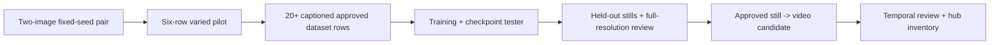

# Figment end-to-end delivery plan

Current status, September 14: use the [current overall plan](2026-09-12-overall-plan-review.md) for remaining work and the [current-source reader guide](2026-09-13-current-source-reader-guide.md) for the accepted manual Windows-local HTTP/UI journey. The latest [four-image prompt-span diagnostic](2026-09-13-prompt-framing-diagnostic-plan.md) is terminal: 0/4 framing passes and no clear paired improvement. No production checkpoint, still or video quality is accepted. The dated snapshots below preserve earlier evidence, balances, consent states and proposed next steps; they are not the current task queue or authorization state.

## Historical decision — September 11

Disposition recorded September 11, about 19:30 UTC (superseded the earlier September 11 and September 10 paragraphs below wherever they conflicted): the second final-checkpoint diagnostic completed at 19:27:40 UTC, pod `h4sqcy2ewe3g8p` removed, for an estimated cost of $0.224635; independently queried provider pods returned empty around 19:30 UTC. That day's three paid rows (training plus both diagnostics) totaled an estimated $2.859835, bringing the then-recorded arc to about $33.489565 of $50. These are measured READY-rate estimates, not final invoices.

Root viewed all ten new images plus the five historical LoRA images and the canonical reference. All ten new images fail the requested whole-head-plus-shoulders/upper-chest framing: each extends to torso/waist or elbows. All are adult and clothed, with no obvious gross garment or anatomy failure at displayed resolution. The five new-checkpoint LoRA faces differ modestly from the historical LoRA faces, with uncertain geometry and styling tradeoffs and no demonstrated material identity improvement. Neither checkpoint is production-approved. Because training combined the crop, caption, and seed intervention together, this diagnostic is reused evidence against the same protocol, not a fresh generalization test or isolated proof that cropping alone caused any change.

Three blinded visual reviews by actual `claude-opus-5` completed under `MAIN/_private/figment-claude-crop-blind-visual-20260911-v1`, `v2`, `v3` (`result.json` each). The first two weakly favor the historical checkpoint's resemblance, largely on cosmetic grounds; the third weakly favors the new checkpoint at image `271828`, allowing a tie. Root rejects v3's framing-pass claim for the base-model control at seed 271828 because it shows torso to elbows. The weak resemblance preference at that seed compares the new and historical LoRA images; neither LoRA image passes framing. There is no unanimous improvement across the three reviews. The technical image-binding audit has since run to completion and passed all 252 of 252 actual checks at 19:53 UTC, verifying all ten full PNG graphs against the apply job and historical graphs, dimensions, base-condition RGB identity across all five base images, LoRA RGB divergence across all five new-checkpoint images, all sixteen original/review-copy hashes, deterministic reproduction, correct A/B/C bindings, checkpoint bytes, teardown, and cost; see `MAIN/_private/figment-selective-crop-heldout-control-20260911-v1/diagnostic/audit-review-v3.json`, executed by actual `claude-opus-5` job `figment-claude-diagnostic-and-base-proof-20260911-v1`. Two earlier artifact-verification attempts (v1, a recheck v2) hit tooling limits and are not accepted evidence.

Root has stopped this research experiment without promoting any media and without automatically sweeping other checkpoints, prompts, or training recipes. Further compute requires a new discriminating question and a prospective bounded plan; no paid run is currently queued. Other offline work (nonpersona preparation, base-workflow extraction/audit) continues in parallel. See the [selective crop source review](2026-09-11-selective-crop-source-review.md), the [face-coverage review](2026-09-11-face-coverage-review.md), and the current handoff `handoffs/2026-09-11-figment-selective-crop-running.md` for the full evidentiary chain.

Prior disposition, September 11, 19:15 UTC: the V4 ten-image LoRA/no-LoRA diagnostic against the original checkpoint completed with verified teardown for $0.247567; root and two independent Opus visual reviews agreed the LoRA condition showed stronger resemblance to `g01` than the no-LoRA control, with remaining facial-proportion differences across the set, and all ten outputs missed shoulders-up framing, and no production media resulted. A face-coverage/drift audit (33 pins, 22 face-sheet cells, independently verified) informed a targeted intervention: five of the twenty accepted training rows received matching 512-square selective crops and revised captions, the other fifteen and both eval-only rows (pilot 03/06) were unchanged. The crop/caption code plus an optional pinned `process.training_seed` field landed locally at `dca886ec` (94 tests passing in 55.66s) with independent Opus review READY WITH COMMENTS and no blockers.

A predeclared 1250-step training run using that crop/caption/seed combination completed at 09:31:54 UTC; all five resulting checkpoints were downloaded and hash-verified, and independently queried provider pods returned empty at 19:11 UTC, for an estimated cost of $2.387633. The final checkpoint's selection rule was predeclared; its SHA `3893fef3323cd5a37e8fd98fb2f8c06c068195a677270263ac02400cb37cd832` was measured after the run completed, not predeclared. This run is a combined crop/caption/seed intervention against an unseeded historical baseline, not an isolated crop causal claim, and it reused the existing diagnostic set rather than establishing fresh generalization evidence. A new ten-image LoRA/base comparison against this final checkpoint, using the identical V4 manifest, seeds, prompt, and tester pins, started at 19:15:20 UTC on pod `h4sqcy2ewe3g8p` and completed as described in the current disposition above.

Prior disposition, September 10: v2 training and its five-image tester completed with verified receipts and teardown. The actual local board has all automatic gates false. Root found the final two checkpoints promising, but independent review culled all five; root recorded an attributed all-cull disposition without selecting a checkpoint. The ten-cell diagnostic compiler and rejection CLI are independently READY at `f6f646e8`. Final V3 native dry-run passed, but automatic approval review blocked the private checkpoint upload before launch. Exact transfer consent is pending; no private diagnostic pod or cost row exists. The subsequent public-only seed-1595 prompt comparison completed both frozen text conditions for $0.220279, with no private uploads, verified teardown, and zero active pods at that final check. The tighter wording still missed the whole-head and upper-chest framing target and did not establish the intended age presentation, so both reviews stop this wording branch. The subsequent two-image public sampler comparison completed at 03:29:44 UTC for $0.232424 with zero uploads and verified teardown. Root at 03:40:14 UTC verified actual graphs, reproduced baseline RGB, and zero API pods. Both reviews stop the sampler branch for insufficient shoulders-up framing improvement; no setting search or quality acceptance follows. Reconciled arc is $30.629730/$50 and local-September-9 daily estimate is $5.735059/$10. See the [sampler review](2026-09-10-public-sampler-comparison-review.md). See the [prompt comparison review](2026-09-10-public-prompt-comparison-review.md), [quality decision](2026-09-09-checkpoint-quality-decision.md), [code review](2026-09-09-control-rejection-review.md), and [transfer status](2026-09-09-runpod-checkpoint-transfer-status.md).

The generated-input gallery is complete at `adcf4591` and independently READY. The read-only content-brief inventory and Research-tab display are also independently READY and committed at `3ed8eaa9`; focused tests, typecheck, production build, and the actual local collector probe passed. A scrubbed local fixture passed desktop and 500px screenshot layout review (Edge minimum observed layout 496px); this is not a true 390px or authenticated-deployment check, and the hub remains undeployed. These checks create no asset-completion, audience-metric, or accepted-identity claim. See the [content-brief hub review](2026-09-10-content-brief-hub-review.md) and [ledger-plan binding review](2026-09-09-ledger-plan-binding-review.md).

Build the smallest complete creator-001 path around the existing `figment_train.py`
contract, then make an approved still output the entry point to video and the existing
hub. Do not build another orchestrator. The system has a tested still-image planner/runner,
an evidence-preserving review gate, a diagnostic video compiler, and a locally built hub;
it does **not** have a quality-accepted identity, curated production dataset, accepted
production LoRA, held-out still set, or production video. Instagram remains deferred.

The hard user criterion is a consistent fictional adult woman who reads about 21, is
recognizably the accepted identity across variations, looks real at full resolution, and
is clothed. A completed command, green unit test, provider receipt, or model score is not
proof of that criterion.

## Historical implementation snapshot — September 9–11

| Capability | Built / locally verified | Live-proven | Quality accepted |
| --- | --- | --- | --- |
| Persona, pins, bounded pod harness, plan/run/grade/ruling/gate CLI | Yes; `pipeline/figment_train.py` and its tests | Several historical train/tester runs | No production lineage |
| Identity gate and lineage binding | Yes; fail-closed records and bounded research curation | Current 20-train/2-eval built-in set was materialized and verified | Dataset-only research acceptance; no production identity claim |
| Reference-conditioned routes | OmniGen2 and Qwen cloud pairs are complete and rejected for expansion; built-in direct-`g01` expansion and curation are complete | Omni V1/V2 failed; V3 and Qwen completed rejected pairs with verified teardown. Built-in path completed 21 generated originals. | Bounded research dataset only |
| Training and checkpoint tester | Two-stage train-first plan, manifests, pins, provenance checks, tester path, and a reviewed selective-crop/caption/seed dataset intervention (`dca886ec`) | V1 failed before upload; v2 training and five-image tester completed with verified teardown; a further 1250-step crop/caption/seed run completed 09:31:54 UTC September 11 with five hash-verified checkpoints and verified teardown; its own held-out diagnostic against the final checkpoint completed 19:27:40 UTC September 11 with verified teardown and a passed 252/252 technical audit | No checkpoint selected: v2's root/independent-review disagreement stands, and the new checkpoint's diagnostic showed no material identity improvement, with mixed/weak blinded-review preference and persistent framing misses |
| Held-out stills | V3 final-LoRA/no-LoRA control compiled and dry-run locally (ten synthetic jobs, own ledger, teardown true) | V4 ten-image LoRA/no-LoRA diagnostic against the original checkpoint completed with verified teardown ($0.247567); a further ten-image diagnostic against the new crop/caption/seed checkpoint completed 19:27:40 UTC September 11 (pod `h4sqcy2ewe3g8p` removed) with a passed 252/252 technical audit | No; both diagnostics missed shoulders-up framing. V4 showed stronger LoRA resemblance than its base control, while the new checkpoint showed no material improvement over the historical LoRA. Neither diagnostic creates accepted lineage |
| Video | Native Wan compiler, assembly/extraction, and reviewed approved-still adapter; 18 distinct focused tests include actual approval-to-upload integration | V1, V2, and V3 clips completed; V2/V3 were stable in their inspected conditions | No production identity/temporal acceptance |
| Hub | Existing galleries have historical desktop/mobile QA; cloud lifecycle and generated-input gallery are complete | Cloud lifecycle 147-test slice, then 29 post-review tests; gallery 124 affected tests, typecheck, actual original-route probe, and production build passed | No accepted production lineage to display yet |

Sources: `orgs/figment/pipeline/README.md`, `orgs/figment/research/book/README.md`,
`docs/figment/2026-09-08-video-integration.md`, and
`docs/figment/2026-09-09-reference-pair-launch-packet.md`.

Before V3, the ledger total was $37.922815 of the $50 arc. The user explicitly authorized the
g01 transfer with “Continue.” V1’s failed archive URL ran 53.63 seconds at $0.019366 with no
uploads. V2 completed bootstrap, model staging, and g01 upload but stopped on HTTP 400 after
340.394 seconds at $0.103064; the unretained response was later diagnosed against the pinned
source as an omitted `resolution_steps` field.
Both failed pods have verified termination. V3 subsequently completed two images and verified
termination for $0.325452, bringing the arc to $38.248267. Both quality reviews rejected
expansion. Qwen completed for $0.530662 with verified teardown and both reviews STOP; see its
[current launch status](2026-09-09-qwen-reference-launch-status.md).

## What to take from the inspirations

10sorLabs markets a workflow sequence of identity lock, dataset generation, LoRA training,
and quality enhancement; its site describes these as product capabilities, not independent
quality evidence. [10sorLabs home](https://10sorlabs.com/) The useful implementation lesson
is the sequence and a small set of explicit handoffs, already reflected in Figment's
still-image stages. Its package research further supports training on a curated set and
testing checkpoints before broad generation; its account-growth and evasion material is
out of scope and rejected by Figment guardrails.

Eromify markets a persona-to-images-to-short-video content flow. [Eromify influencer maker](https://www.eromify.in/ai-influencer-maker)
That is a product claim, not evidence that its identity or video quality holds. The useful
product inference is to make the user-facing flow legible as a small sequence of named
assets: accepted identity, approved dataset, selected checkpoint, held-out stills, video
candidate, then library/hub. Figment should retain its stricter lineage, explicit human
rulings, and no-publish boundary rather than copying a one-click workflow.

## Critical path and gates



Root adjudicates bounded research continuation from recorded evidence; authorized research
does not wait on a mandatory human or consensus gate. Independent review remains a useful code
and evidence check where assigned. Human production promotion remains distinct. For any bounded
work order, allow at most two repair cycles after its first attempt; then stop and preserve the
evidence for a new hypothesis or ruling.

### Phase 0 — two-image pair, then a six-row varied pilot

The Omni and Qwen g01 cloud pairs completed, and both root and independent reviews stopped each before expansion. The completed built-in six-image pilot used g01 directly for every slot rather than chaining generated images. Its root and independent Sol reviews found a consistent, promising research hypothesis, without promoting an image into a dataset.

The candidate inventory now has g01 plus 21 first-generation direct-`g01` derivatives. Pilot 03 and 06 remain eval-only; the accepted bounded research set contains 20 train rows and two retained eval rows. Materialization preserved original evidence and produced 20 RGB-equivalent numbered trainer PNG/caption pairs. This is not a training result or a production identity claim.

### Phase 1 — turn accepted identity evidence into a curated dataset

The existing `figment_train.py` review/ruling model has now materialized the hash-bound 20-train/2-eval set. Eval rows stay out of trainer media. The 21 raw YuNet/SFace identity observations (six pilot and 15 expansion) remain unthresholded diagnostics, not an identity verdict. The accepted dataset is limited to one bounded research LoRA trial; it does not clear production dependencies, production identity, or publication. OmniGen2's 3B Qwen-derived encoder remains research-only, while Qwen's pinned 7B Apache-metadata stack still needs separate production clearance. See [component licence evidence](2026-09-09-qwen-component-license-evidence.md).

The replacement v2 train-first plan is locally reviewed, and isolated dry runs of its exact train and tester manifests passed. Training completed at 22:37:53 UTC with a final receipt, five separately verified local checkpoint digests, and verified teardown; the five-image tester subsequently completed with its own verified receipt and teardown. Root's original-resolution notes retain steps 1000/final as promising diagnostic evidence, while an independent review culled all five for canonical identity and intended age. No checkpoint is selected. Do not hand-edit or replay either immutable plan. Completion supplies mechanics and checkpoint bytes, not a selected checkpoint or quality result.

### Phase 2 — train, test, and select a checkpoint

Run the existing `train-first` path against only the approved captioned set. Test each produced
checkpoint with the current tester plan and fixed holdout prompt family. Do not accept a
checkpoint from a training completion alone: `apply-rulings --checkpoint-step` already
requires a kept tester candidate and binds its source bytes. Compare the selected candidate
to g01 and held-out references at full resolution for the user criterion, not cosine alone.

### Phase 3 — held-out stills

Use `figment_train.py plan/run/grade/apply-rulings/gate --stage gen` with the chosen checkpoint
to make a deliberately held-out still set. The first accepted set should be small and varied,
not a content batch: front/quarter turn, two lighting conditions, and two clothed settings.
The output must preserve the adult-about-21 read and identity under variation before it becomes
a video start-frame candidate.

### Phase 4 — video

Do not promote the current Wan diagnostics. V1 was rejected for face distortion, colored
streaks, and background warping; V2/V3 establish bounded clips under their inspected
conditions only. The approved-still adapter is built, reviewed and committed, with 18 distinct
passing tests including actual approval and harness upload expansion. It consumes existing approved `gen` lineage while retaining the compiler’s diagnostic,
non-promotable output. Start with one short, low-motion clothed shot and inspect
first/middle/last frames plus the complete clip. A video failure does not invalidate the still
checkpoint; it blocks video only.

### Phase 5 — hub

The existing hub already projects generated inputs, matched/profile galleries and training
results in `dashboard/server/figment/**` and `FigmentWorkspace.tsx`; desktop/mobile checks
are recorded. Extend its proven projection discipline to the accepted lineage when it exists,
while retaining explicit diagnostic/unapproved labels and preventing private-path, prompt, or
credential leakage. The historical 141-case targeted batch recorded 140 passes and one pass-1
timeout; its isolated fix now passes in 496 ms. The cloud lifecycle five-file slice passes 147
tests. Instagram is deferred after the hub work.

## CLI decision after code review

The existing [operator runbook](2026-09-09-operator-runbook.md) is correct for the tested `ea5d2038` train-first-to-fresh-`gen` join; do not add a new bridge.

Do **not** add `intake-reference-pair` now. `figment_train.py` already has the relevant
dataset-lineage checks, `accept-dataset`, `train-first`, and `held-out-diagnostic`; its
dataset approval accepts curation evidence and its train-first path verifies current media,
caption and approval inventories. Adding a parallel pair-intake schema before seeing the
approved pair would duplicate an established boundary and create another state to reconcile.

The smallest reusable user-facing capability, if the pair supplies candidates worth curating,
is a narrow extension of the existing curation-evidence validator used by
`accept_train_first_dataset`, not a new command. First write fixtures from the actual pair
receipt and determine the precise missing field. If the current validator accepts the needed
hash-bound curation record, the correct change is zero CLI surface area.

Known local acceptance commands use the full Python 3.13 executable, not `py -3`:

```powershell
C:/Users/danie/AppData/Local/Programs/Python/Python313/python.exe -m pytest orgs/figment/pipeline/tests/test_figment_train.py -q
C:/Users/danie/AppData/Local/Programs/Python/Python313/python.exe orgs/figment/pipeline/figment_train.py held-out-diagnostic --help
C:/Users/danie/AppData/Local/Programs/Python/Python313/python.exe -m pytest orgs/figment/pipeline/video/tests -q
```

## Active sequence and completion criteria

1. **Content asset-binding adapter is technically READY.** The [adapter plan](2026-09-10-content-asset-binding-plan.md) joins an unchanged, replayed content brief to current approved gen stills through `validate_approved_gen_still`. It requires exact attributed slot-fit decisions, current persona/reference identity binding and approval provenance. The final full content suite passed 47 tests for the author and 47 independently; root source/hash/log review accepted technical READY. The real producer-to-isolated-CLI join and CLI failure without partial output both pass. See the [independent review](2026-09-10-content-asset-binding-review.md). It neither approves assets nor invents video authority.
2. **As of the September 10 checkpoint** — **Assignment hub and prospective video producer are independently READY.** The optional Research assignment snapshot passed 59 focused tests, typecheck/build and qualified fixture QA. The candidate producer passed 61 independent video tests and the real approved-gen-to-unchanged-runner dry-run join. Root verified the actual candidate graph/upload/receipt and a separate native1280x704,81-frame assembled movie. The [producer review](2026-09-10-video-candidate-producer-review.md) records current persona binding, bounded snapshots, reserved output namespace and native assembly. Current-evidence review preparation is independently READY: 74 video tests and the actual producer-to-subprocess CLI join passed; root verified the canonical record, all81 frame hashes/graphs, receipts, native MP4 and samples. See the [preparation review](2026-09-10-video-review-preparation-review.md). The separate attributed-rulings/accepted-video-validator slice comes next. The Studio design exposed stale upstream approval at gen execution; its narrow consumer repair is independently READY, with four final focused tests and root verification of stopped-state preservation. After the native workers hit their usage quota, Claude Sonnet resumes the local provider-free Studio plan-control repair and Claude Opus completes the video ruling authority. Root reproduced a real planner/control mismatch (decimal-string cost ceiling rejected as nonnumeric); the interrupted repair remains WIP. Both CLI response models are verified, tasks are bounded, and root runs tests before independent review. Neither slice is accepted yet, as of that September 10 checkpoint. No live endpoint exposure, provider or production approval action is implied. The shared runner and existing diagnostic defaults remain fixed. This has since been superseded: the accepted repair at `ec58decf` (Studio, video terminal authority, motion-source binding, HTTP surface; full video suite 187 tests PASS) resolved the quota-blocked repair described above, and the Studio stored-plan inventory server (`749abdca`) plus durable session resume (`01cefd3d`) landed independently READY. Full Studio input/launch/review workflow remains unfinished.
3. **Resolve the quality hypothesis before more training.** Public wording and sampler comparisons are complete and stopped. The private LoRA/no-LoRA five-seed diagnostic against the original checkpoint (V4) ran to completion on September 11 with verified teardown, showing stronger resemblance but persistent lip/lower-face drift and missed shoulders-up framing. A face-coverage audit then motivated a bounded selective-crop/caption/seed dataset change and a further 1250-step training run, whose own held-out diagnostic against the identical V4 protocol completed 19:27:40 UTC on September 11 with verified teardown and a passed 252/252 technical audit; root found no material identity improvement over the historical checkpoint, with mixed and weak blinded-review preferences and every new image still missing shoulders-up framing. Root has stopped this experiment without promoting any media or automatically sweeping other checkpoints, prompts, or training recipes. Continue independent research and local infrastructure meanwhile. A new quality experiment must name its changed variable, evidence, budget and stop condition before execution.

Infrastructure completion means each supported stage consumes the previous stage's real output with current lineage, meaningful failure tests, independent code review and a usable local hub/runbook. Product-quality completion additionally requires a recognizably consistent fictional adult who reads about 21 identity over held-out poses/settings, accepted stills and inspected video continuity. The current project meets neither full completion condition yet. No code-test count substitutes for the quality evidence.

Standing user authorization covers continued local implementation, fixes, research and bounded RunPod experiments within the $50 arc. It does not override an actual rejected private-payload transfer, authorize publication/Instagram, or turn rejected imagery into acceptance. The previous finite keep-awake lease expired during the quota pause. Root renewed it at 16:31:34 Eastern on September 10; supervisor64772 and root56824 were verified alive and armed, with a new16-hour bound through about08:31 Eastern September11. The 8 AM checkpoint is a progress report, with continued work or a completed resumable handoff afterward.

## Resumed work and alternative pathways - September 10, 20:42 UTC

The active build path has four bounded slices. First finish and independently verify
video terminal decisions and the Studio plan-preparation control. Acceptance requires
actual producer/consumer fixture joins, failure-state preservation, bounded subprocess
time/output and current lineage; source-only worker reports are insufficient.
Second, use the sole accepted-video validator in the existing content adapter for
persona motion slots. Preserve the distinction between accepted source footage and
finished reel delivery: native1280x704/16fps footage does not satisfy the current
1080x1920/30fps template by itself. Stale upstream media, wrong persona and diagnostic
clips must refuse before assignment. Third, expose bounded video-review and asset
states in the existing hub with unchanged auth and explicit missing/parked/rejected
states. Fourth, exercise one documented local operator journey over fixtures from
training selection through still/video review and assignments, including refusal and
resume. A fixture journey demonstrates infrastructure only; actual identity and
full-playback acceptance remain separate evidence requirements.

The following are hypotheses for a new experiment, not findings or permission to
replay stopped experiments:

- **Framing and source coverage:** the public base also misses the requested crop,
  so LoRA alone cannot explain framing. Audit existing captions, effective training
  buckets and source crop diversity locally before another run. If a concrete mismatch
  is found, change only that factor in a fresh bounded experiment; preserve originals.
  Stop if improved framing loses identity, realistic skin, whole-head coverage or adult
  presentation. This audit can proceed without a private export.
- **Single-anchor generalization:** every retained derivative shares g01 ancestry;
  two held-out derivatives do not supply independent reference evidence. A new dataset
  experiment must predeclare pose/lighting/expression coverage and exclude evaluation
  rows by provenance. First determine whether the existing rows cover that matrix.
  Do not expand or retrain merely to increase sample count. A new seed would be an
  explicit new hypothesis and persona revision, not a silent replacement for g01.
- **Checkpoint contribution:** the prepared five-seed LoRA/base diagnostic distinguishes
  checkpoint-specific drift from base-model behavior more clearly than the completed
  single-seed controls. Consent was granted and the diagnostic against the original
  checkpoint (V4) ran to completion September 11 with verified teardown; a further
  diagnostic against the newer crop/caption/seed checkpoint completed 19:27:40 UTC the same
  day with verified teardown and a passed 252/252 technical audit, and root found no
  material identity improvement over the historical checkpoint. Each diagnostic was judged
  against its own predeclared paired protocol. This experiment is now stopped; do not
  reroute the checkpoint or invent a selected checkpoint to unlock a further diagnostic.

Further model or serving changes require a named hypothesis and a small discriminating
control. Official Raw-training/Turbo-serving is already the intended Krea pairing; a
change is not justified merely because the two names differ. No new open-ended sampler
search, metric-threshold relaxation or blind retraining is scheduled. Local source
and dataset inspection will determine whether another unblocked experiment has enough
expected information to justify its cost.

The user requested mostly Claude CLI implementation. Sonnet/Opus response IDs and
prospective usage are recorded in each bounded worker result; historical native token
usage remains unavailable. A separate Fable strategy review was rejected by automatic
approval review for its internal-plan transfer and has not run. That rejection is
isolated; that implementation wave has now finished or stopped at its explicit limits.

## Review and test cadence

For every work order: (1) write the input/output schema and failure cases; (2) implement with
focused unit tests; (3) run the stage's existing suite; (4) obtain an independent adversarial
code review for path boundaries, lineage, and stale-state handling; (5) repair at most twice;
(6) run the exact local acceptance command and record only the observed result. A live run is
separate and requires the existing cost/card/harness checks. A human visual acceptance is
separate again.

Historical pre-diagnostic snapshot, September 10: the Omni and Qwen cloud runs were complete and terminated. The separate rejected Codex self-comparison transfer remained pending its exact answer; it had not run or been rerouted. The accepted bounded research dataset existed. Train-first v1 failed before upload or training and was terminal; v2 training and its five-image tester completed with verified receipts and teardown. The root/independent visual disagreement left every checkpoint unselected. At that checkpoint no paid LoRA/base diagnostic, accepted still, or current video had run. The later September 11 diagnostic results are recorded above; current quality status is in the overall plan.

Final verification at Studio `b7100774`: the two real producer/consumer joins (train-first to fresh generation, and approved generation to video upload) also passed after the ledger fix: **2 tests in 34.20 seconds**. These are local fixture-based integration checks, not accepted image-quality evidence.

## Overnight loop review - September 10

This is the existing user-directed build session with bounded worker tasks, not a new recurring daemon or HEARTBEAT cadence. The loop-design-check review yields these operating conditions:

| Failure mode | Concrete control |
| --- | --- |
| Vague completion creates endless work | Each work order names an actual producer and consumer, observable success/failure commands, changed paths and a deliverable. The coverage audit decides the next gap. |
| Author judges its own work | A separate review session checks frozen source; root runs focused evidence and reconciles actual artifacts. Record requested and actual CLI response models, observed usage and telemetry gaps separately. |
| Green tests hide a broken product | Exercise real producer-to-consumer joins and subprocess exit/output behavior. Do not loosen quality thresholds, delete failing tests or create a keep ruling to advance a stage. |
| Missing permission discovered mid-run | Standing build and bounded compute authorization are recorded. Actual private-transfer rejections remain isolated until their exact answer. Other independent work continues. |
| Stale state causes reruns | Update the canonical handoff and current STATE after terminal run results. Preserve failed preparations and receipts; do not replay a completed attempt. |

A worker repair is limited to the existing two repair cycles for that work order. A recurring defect then requires root to preserve the evidence, reassess the design and choose a different bounded task or hypothesis. Paid jobs additionally retain the native one-placement, time, daily and $50 arc limits and independently verified teardown. Polling does not authorize another job.

The user's standing instructions authorize root research decisions and continuation; this review introduces no new mandatory human gate for ordinary implementation. Publication, production promotion, rejected private payloads and merges/deployment retain their applicable boundaries. Apparent age and identity consistency remain explicit visual evidence requirements; neither a numeric score nor a code-test exit decides them automatically.

Keep-awake was independently checked again at 04:01:32 UTC: supervisor and root CLI lease alive. The 8 AM checkpoint reports completed work, current worker/task, remaining quality evidence, spend and keep-awake status. If work remains independently actionable, continue it. If complete, leave the verified result and resumable handoff. Keep-awake is finite and requires renewal before its approximately 09:44 Eastern expiry if the session continues; an armed power lease alone is not evidence that an LLM worker is executing.


## Completed local checkpoint and next boundary ? September10

This is the September 10 checkpoint record. The subsequent [September 11 repair review](2026-09-11-repair-checkpoint-review.md) accepted the bounded technical repair diff; its review is no longer pending. Later implementation and remaining work are tracked in the current overall plan linked above.

`2ef9f36a` saves locally tested Studio preparation and video terminal authority. Studio137PASS/typecheck/build; video177PASS plus final5targetedPASS. Independent review of those new slices remains pending exact source-transfer consent. Source pins and failure evidence are preserved in the canonical handoff. A separate tools-disabled Sonnet/Opus generic design loop produced the [motion source/delivery contract](2026-09-10-motion-source-delivery-contract.md); the existing content producer/reader integration is the next code slice, not a new renderer. A separate two-image [seed audition](2026-09-10-seed-b-audition.md) was stopped for directed-pose failure and unestablished intended age; it does not replace g01 or start training.
