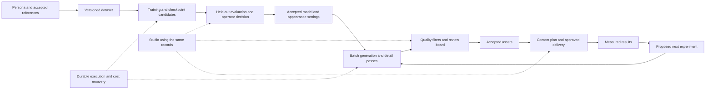

# Figment architecture analysis — 2026-09-07

Status: DRAFT assessment and recommended direction, not an approved implementation plan.
Analysis began Sept 7 and continued Sept 8.
Source snapshot: `claude/figment` at `a005f6d0`; analysis branch
`codex/figment-analysis-2026-09-07`. Historical run metadata and fixtures were also
read from `C:/Users/danie/kb-worktrees/figment`. No implementation or governance was
changed. The operator explicitly authorized continuing after the budget preamble
failure and allowed paid compute. No new paid GPU job was launched during this audit.

**Assessment.** Figment has a substantial experimental image-production core, a
documented studio design, and useful execution safeguards. It has not yet demonstrated
a repeatable studio that produces accepted output across creators. The missing proof
is the connection between quality, reproducible inputs, durable decisions, recoverable
execution, and the operator-facing workflow. More training alone will not supply it.

**What we are building and what the reference establishes.** The operator's
[mandate](../MANDATE.md) describes one identity progressing through dataset expansion,
LoRA training, appearance settings, image and video production, review, content planning,
publishing, and measured improvement. Several fictional adult creators should use the
same machinery from one studio. Creator-001 is a test case for that machinery.

10sorlabs currently advertises ComfyUI workflows, LoRA dataset/training tutorials,
image enhancement, editing, video workflows, and social playbooks. Its public panel
is a lesson/download interface. These sources support a modular creative-workflow
reference; they do not establish a managed, autonomous production service or an
uncurated identity-quality benchmark. Figment's integrated execution, approval,
scheduling, and analytics requirements come from our own mandate.
[Public product](https://10sorlabs.com/),
[public toolkit panel](https://webpanel.10sorlabs.com/) (checked this session).

The purchased-package analysis in [r15](r15-10sorlabs-artefacts.md),
[training notes](r15b-training.md), and [generation notes](r15b-generation.md)
is stronger evidence about individual workflows than storefront claims. It is still
cached research: this session did not independently rewatch every purchased video.
No purchased source content is redistributed in this report.

**How the project arrived here.**

| Period | Change and evidence | What it establishes |
| --- | --- | --- |
| Initial expansion experiments | Klein-based expansion-02 and expansion-03 produced datasets; the operator rejected their quality, including a reversal of an earlier thumbnail-based keep judgment | Scores and small previews were insufficient quality evidence |
| Track 1, Sept 3–4 | Ported the package's dataset/training/tester sequence; 31 dataset cells, an eight-checkpoint training run, and tester outputs were recorded | The remote production chain can execute; the operator still found gloss, apparent-age drift, and inconsistency |
| Track 2, Sept 6 | Added an anchor candidate route, proposed closer module parity, and developed automated quality filtering; the new anchor route was rejected for creator-001 | Choosing a new face and preserving an already chosen face are different product tasks |
| Sept 7 | Trained a 1,250-step model with differential output preservation; unified train-first planning, hardened grading, and fixed the missing tester trigger | A new candidate model exists, but its valid post-fix quality result remains unproven |
| Latest handoff | Two tester attempts recorded unverified pod teardown during local network failure; the later narrative records manual termination | The original receipts do not reconcile themselves after recovery; local watchdog/retry logic is insufficient as the only recovery mechanism |

The record is [STATE.md](../STATE.md), the Track-2 handoff on `origin/ops`,
and the historical `c001-tf*` run metadata. STATE's early sections are history;
its initial model choices and "Next" lists should not override later decisions.

**Current capability versus intended studio.**

| Capability | Present evidence | Remaining proof or implementation |
| --- | --- | --- |
| Persona configuration | `persona.yaml`, training sidecar, references, identity/look schema, validation | Portable assets and internally consistent versioned configuration; a second real persona |
| Dataset and training | Shared planner, ComfyUI manifests, training wrapper, recorded real runs | Every training input must trace to an accepted dataset revision, including train-first |
| Checkpoint testing | Fixed-comparison tester, explicit trigger composer, multiple recorded checkpoints | Valid post-fix tester followed by held-out prompts and seeds; accepted checkpoint selection |
| Generation and detail | Gen-stage builders and tests; optional detail branch | Demonstrated final output quality, including identity preservation through detail/refinement |
| Quality review | Numerical metrics, vision judge, boards, per-cell rulings, fail-closed checks | Held-out validation against the operator's labels; one consistent decision/asset contract |
| Execution and cost | Per-plan bounds, manifest checks, stage/run files, estimated ledger, local teardown verification | Recovery independent of the initiating desktop process; reconciled uncertain charges; portable resume |
| Content planning | Taxonomy/templates and research notes | A working content-to-approved-batch path that consumes accepted assets |
| Agents and cadences | Nine declared roles, workflow description, seven unarmed cadences | The workflow's `creator` execution profile is absent from the inspected dashboard registry; registration/integration must be corrected before end-to-end execution |
| Studio | Six routes and acceptance criteria specified | Implemented views and shared CLI/UI behavior; no Figment-specific dashboard implementation found |
| Video, voice, accounts, publishing, analytics | Design and research coverage | Executable integrations and acceptance evidence; these are later capabilities, not delivered studio features |

The existing [design](../../../docs/superpowers/specs/2026-09-03-figment-creator-001-design.md)
already specifies Creators, Generate, QA Board, Calendar, Accounts, and Analytics.
The recommendation is to realize that design incrementally around the working core,
not invent another application architecture in parallel.

**Concrete breaks in the existing path.** The code audit found integration issues
that are more urgent than adding another model or more agent declarations:

- **Review freshness is disconnected.** `gates.py` defines a human decision bound to
  a subject hash. The CLI instead writes and consumes a different per-cell score
  `gate.json`, matching rows by image ID without rechecking the reviewed image bytes.
  Both mechanisms exist, but the intended freshness check is not on the operative path.
- **Train-first assumes curation.** Its planner checks for `_dataset.ready` and
  `dataset_manifest.json`, then copies the directory. It does not enforce that the
  cells and captions match an accepted dataset revision. The upstream score selector
  is not a substitute for that provenance check.
- **Checkpoint selection does not reach generation.** The generation planner requires
  `chosen_checkpoint_step` and tells the operator to run tester `apply-rulings` first.
  That command writes approved-image records but has no tester branch that saves the
  selected checkpoint into the training configuration. The advertised transition
  therefore still requires a manual configuration edit and lacks an accepted-candidate
  binding. Close this before claiming the six-stage path is complete.
- **The workflow declaration is incompatible with the dashboard registry.** It names
  `profile: creator`, while the inspected server registry has six other profiles.
  Its own 22 passing YAML/structure tests do not exercise that parser boundary.
- **Resume and pause semantics are incomplete.** `all` has a dataset-review stop but
  no equivalent anchor-review stop. A failed or still-running attempt refuses a new
  launch, which prevents duplication, but there is no reconciled recovery transition.
- **The gate command displays cached results.** Despite the README's suggestion to
  rerun it after editing thresholds, it reads the saved score document rather than
  recomputing it. The operator must not mistake refreshed presentation for new evaluation.

See [the code audit](2026-09-07-architecture-code-evidence.md) for exact functions,
triggers, and limits. These are source-backed findings at the inspected snapshot;
the live dashboard parser was not executed because its `ajv` dependency was unavailable.

**The important distinctions the current research sometimes blurs.**

1. A technically completed run is not an accepted image. The no-trigger tester recorded
   successful orchestration while failing to test the intended identity invocation.
   The current trigger fix is real, but it does not retroactively validate that run.
2. A similarity score is not the operator's quality judgment. The VLM calibration
   passes 23/35 expansion-03 images although the operator had rejected that batch's
   overall quality. Skin/gloss/artifact thresholds are explicitly not validated as
   useful separators. This is a filter worth improving, not an acceptance oracle.
3. Research hypotheses are not causal results. Missing production detailing may hurt
   final generation, but it cannot by itself explain a raw tester designed to omit
   detailing. Added texture adapters need controlled comparison; the m1 skin adapter
   hurt the reported identity metric in that configuration.
4. The m1 statement that no best cell reaches the anchor band contradicts its own
   figures: 85 and 78 fall within its stated 78–88 band. Its small comparison supports
   rejecting those recipes as reliable defaults, not declaring every editing method
   exhausted. See [m1 results](../pipeline/expand/bakeoff/m1-RESULTS.md).
5. The package also mixes model families. The defensible reference distinction is
   that an operator may choose a new suitable generated identity, while creator-001
   requires preservation of an already selected external identity. The claim in
   [r25](r25-why-they-can-and-we-cant.md) that the reference stays inside one model
   family's distribution is too strong for its own described Z-Image/Qwen/Krea stack.

**Recommended architecture.** Preserve the six-stage command and its existing
builders. Give the studio a small set of shared records that the CLI, workers, and
UI all consume. The following describes responsibility boundaries, not new services.

Each record needs a clear job:

- **Persona revision:** references, identity/look definitions, and model compatibility.
  Support both creating/selecting a new identity and preserving a fixed one as explicit
  input modes. Do not silently replace the chosen identity to improve a score.
- **Dataset revision:** image/caption hashes, source lineage, curation decisions, and
  intended training role. Train-first may skip dataset generation, but should not skip
  proving the source dataset's reviewed lineage.
- **Experiment/plan:** hypothesis, control, changed variable, seed/prompt slate, pins,
  output expectations, budget and deadline. Reuse the existing plan schema where possible.
- **Attempt and recovery record:** attempt identity, pod identity, execution status,
  output receipts, teardown status, and uncertain financial exposure. Completion of the
  image work and confirmation of compute cleanup are separate facts.
- **Evaluation and decision:** candidate and reference hashes, evaluator version,
  machine findings, operator ruling, and its exact reviewed subject. Changing the
  subject makes the prior decision stale. Automated scores and human approvals must
  remain distinguishable even if shown together.
- **Accepted model/asset:** chosen checkpoint, trigger, compatible base and appearance
  settings, plus accepted output provenance. Later content and publishing consume this
  record rather than selecting arbitrary files from the most recent run directory.

Avoid adding a database migration or another workflow engine merely to express these
records. First unify the contracts already represented by `plan.json`, `stage.json`,
`run.json`, batch state, and the two kinds of `gate.json`. Move persistence only when
concurrency/recovery requirements justify it. An independent recovery process must
survive loss of the desktop runner; simply adding more retries inside that runner
does not establish this property.

**Feedback loops and an attainable first completion condition.**

The build loop is a bounded worker change, independent review, focused test, and
integration check. The model experiment loop freezes its hypothesis and held-out
comparison before generating; a failed result changes one justified variable or parks
the experiment. The operational loop reconciles durable attempt records against the
provider and retains uncertainty until absence/charges are confirmed. The business
loop later proposes content changes from measured results, with delivery approval
separate from technical execution. None of these loops should rewrite its own
acceptance standard merely to finish.

The first useful studio slice is complete when a fresh checkout can recover the required
assets, plan a bounded run, compare valid checkpoint outputs on held-out prompts,
record an operator decision, generate an accepted batch, and resume after an interruption
without duplicating compute or trusting stale review. A second real fictional persona
must use the same path with data changes only. Initially expose Creators, Generate,
and QA Board; connect calendar/accounts/analytics once the accepted-asset path exists.
Images establish the first proof; video and synthetic voice then reuse the same
lineage, quality, and recovery contracts.

**Verification performed in this session.**

The parent ran `test_creator002_acceptance.py`, `test_gates.py`, and
`test_gen_stage.py` together with pytest, disabled cache writes, and a dedicated temp
directory. The clean worktree result was **8 failed, 33 passed** (4.95 seconds).
All eight failures were missing creator-002 anchor fixtures. Those JPGs and even the
documented placeholder generator are ignored rather than checked in.

After copying only the three existing synthetic placeholder JPGs from the original
worktree, the same selection returned **8 failed, 33 passed** (4.65 seconds).
The next failure was an identity-spec digest mismatch. Read-only byte comparison
proved the source file uses LF, the new checkout has 36 CRLF sequences, and converting
those sequences in memory restores exactly the declared SHA-256. Git's text/eol
attributes for that path are unspecified. No test, spec hash, or production code was
edited; no further repair/test loop was run. This demonstrates a checkout portability
defect rather than refuting all previously passing behavior.

The code worker separately ran the workflow's own structural suite: 22 passed. Its
selection-suite attempt had 5 passes and 17 setup errors from an inaccessible default
pytest temp directory; those errors are not product behavior evidence. The parent did
not count either worker result as an independent rerun of the full suite.

The full 964-test claim was not independently rerun. No new output-quality grading,
training, browser acceptance, deployment, or publishing was performed. Supplementary
source audits are linked below, with their own narrower verification claims.

**Operational and financial state.** The original worktree's five Figment TSVs sum
to $35.690251, comprising $19.665251 in other recorded run estimates and $16.025 in
explicit orphan estimates. Sept 7 alone is $19.397146, causing the $10 preamble failure.
These are local accounting records, not verified provider invoices. The snapshots
have different ledger coverage; evaluating a budget from whichever checkout happens
to be current is not a reliable shared spending boundary.

The normal harness status command could not run here because `requests` is unavailable.
A read-only standard-library request to the documented existing REST endpoint, using
the ambient credential, no proxy inheritance, no redirects, and restricted output,
received HTTP 403 both inside and outside the sandbox. The operator reports RunPod is
up; this terminal has not independently confirmed any active pod or billing state.
No credential value or response body was printed. Paid-compute authorization persists
for this session, but an authenticated provider path and a concrete bounded experiment
are still needed before meaningful paid verification can occur.

**Recommended next sequence.**

1. Establish portable test/assets and reliable attempt recovery. Preserve the two
   observed fixture failures as evidence; fix their cause without weakening hashes.
   Reconcile the outstanding provider state through an authorized functioning connection.
2. Evaluate the already-trained candidate with the corrected invocation before another
   retrain. Show raw and finished output separately; include held-out prompts/seeds and
   an unchanged control. Recover any interrupted attempt before starting a replacement.
   The missing tester-to-generation promotion must be fixed or explicitly handled as
   a reviewed diagnostic limitation before attempting the finished-output leg.
3. Close accepted-checkpoint promotion and dataset/decision lineage in the shared CLI.
   Validate the same path using a second real persona, not only synthetic placeholders.
4. Deliver the first three studio views against those same records and test one complete
   operator journey. Extend to video, content delivery, and measured improvement afterward.

This ordering preserves the existing investment while making the next result interpretable
and reusable. It does not require choosing a new model or framework before the current
candidate and state contracts have been fairly tested.

**Supporting audits.**

- [Code and implementation evidence](2026-09-07-architecture-code-evidence.md)
- [Reference and goal evidence](2026-09-07-architecture-reference-evidence.md)
- [Execution, calibration, and loop evidence](2026-09-07-architecture-loop-evidence.md)

The supporting audits are evidence inputs; the conclusions above distinguish current
code from stale comments and distinguish measured outcomes from proposed mechanisms.
A separate reader reviewed the synthesis and requested that the disconnected gates,
train-first admission, invalid workflow profile, incomplete pause/recovery semantics,
and later manual-cleanup narrative be stated explicitly; those corrections are folded
here. This was a report review, not a formal inspector grade or implementation approval.
